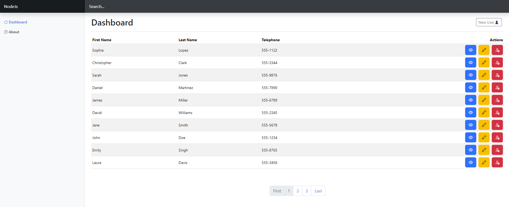

 # User Management System

This project is a **backend-focused** User Management System, designed to manage users efficiently with features like session handling, flash messages, and templating. It uses **Node.js**, **Express**, **MongoDB (Mongoose)**, and **EJS** for rendering dynamic views.

 <!-- Placeholder for your image -->

## Features

- **User Authentication**: Session management using `express-session`.
- **Flash Messages**: Error/success notifications with `connect-flash`.
- **Dynamic Views**: Render server-side views using `EJS` and layouts with `express-ejs-layouts`.
- **MongoDB Integration**: Store and manage user data with **Mongoose**.
- **Method Override**: Support for PUT/DELETE requests from forms.

## Installation

1. Clone the repository:
   ```
   bash
   git clone https://github.com/yourusername/usermanagement.git
   cd usermanagement
   ```
## Install dependencies:
npm install
# Create a .env file in the root directory and add your MongoDB connection string and session secret:

MONGODB_URI=mongodb://localhost:27017/usermanagement
SESSION_SECRET=your_secret_key

# Start the application:
npm start

## Usage
Once the application is running, you can access the following routes:

Home: / - The homepage with login/register options.
Dashboard: /dashboard - The user dashboard after successful authentication.
Logout: /logout - Log out the user and clear the session.
Development

## Prerequisites
Node.js (>= v14)
MongoDB
Running Locally

# Use nodemon for automatic server restarts on code changes:
npm run start
Technologies Used
Node.js: Server-side JavaScript runtime
Express: Web framework
Mongoose: MongoDB object modeling
EJS: Templating engine
dotenv: Environment variable management
express-session: Session management
connect-flash: Flash message handling
method-override: Method override for PUT/DELETE requests
